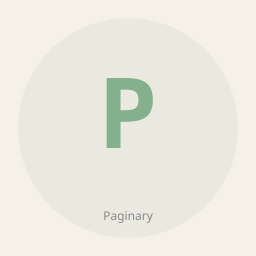

> **Work state:** ARCHIVED-CANDIDATE · **Progress:** `█████░░░░░ 45%`
> VitePress federated doc hub (handbook/specs/xdd/journeys; 465 mirrored .md + custom `paginary-theme`). Redundant with phenodocs (canonical, live on GH Pages): its 465 docs are READ-ONLY COPIES of content canonical in PhenoSpecs/PhenoHandbook/phenoXdd/phenotype-journeys — no unique source-of-truth here, only the theme + federation wiring. Archive pending owner call; migrate `paginary-theme` to phenodocs first if kept. · updated 2026-06-02

# Paginary



[](LICENSE)
[](package.json)
[](package.json)
[](https://sladge.net)

**The Phenotype knowledge collection.** Handbooks, specs, X-driven dev guides, and user journeys as one federated doc hub.

## What is Paginary?

Paginary brings together four pillars of Phenotype documentation:

| Pillar | Content | Purpose |
|--------|---------|---------|
| **Handbook** | Playbooks, governance, operational guides | How Phenotype teams work |
| **Specs** | Feature specifications, ADRs, design docs | What we're building and why |
| **X-Driven Dev** | TDD, BDD, QA governance, smart contracts | How we ensure quality |
| **Journeys** | User flows, onboarding, workflows | How users accomplish goals |

## Cross-Collection Integration

Paginary is part of the **Phenotype named collections**:

- **Sidekick** — Agent dispatch & presence
- **Eidolon** — Device automation
- **Observably** — Distributed tracing & observability
- **Stashly** — State, events, caching, migrations
- **Paginary** (this) — Knowledge collection (specs, tutorials, handbooks)

Paginary documents workflows and event schemas for all collections. As a TypeScript/Vue 3 collection, Paginary integrates with **phenotype-bus** via Node.js MCP adapters (planned). See `../../phenotype-bus/README.md` and `../phenotype-org-audits/audits/2026-04-24/collection_build_matrix.md` for integration details.

## Getting Started

```bash
# Install dependencies
bun install

# Start local development (hot-reload across all apps)
bun run dev

# Build all sites
bun run build

# Preview built sites
bun run preview
```

### Local URLs (after `bun run dev`)
- **Handbook**: http://localhost:5173/handbook/
- **Specs**: http://localhost:5174/specs/
- **X-Driven Dev**: http://localhost:5175/xdd/
- **Journeys**: http://localhost:5176/journeys/

## Release Registry

See `release-registry.toml` for version metadata, stability information, and sub-package status. The master index of all Phenotype collections is at `../phenotype-collections.toml`.

Schema documentation: `../docs/governance/release_registry_schema.md`

## Structure

```
Paginary/
  apps/
    handbook/         → PhenoHandbook content
    specs/            → PhenoSpecs content
    xdd/              → X-driven dev guides
    journeys/         → User journeys
  packages/
    paginary-theme/   → Shared VitePress theme with impeccable baseline
  vitepress.config.ts → Root config (federation index)
  turbo.json          → Turbo monorepo orchestration
  package.json        → Bun workspaces
```

## Key Features

- **Federated Hub** — Aggregate 4 content pillars (handbooks, specs, X-driven dev, journeys) into one navigation interface
- **Hot-Reload Dev** — Edit any source app and see changes instantly across all sub-sites
- **Shared Theme** — impeccable CSS baseline applied uniformly; customize in one place (`paginary-theme/`)
- **Turbo Orchestration** — Parallel builds, incremental task execution, and cross-app dependency tracking
- **Type-Safe** — Full TypeScript + Vue 3 static typing; no runtime surprises
- **SEO & Accessibility** — VitePress built-in: sitemaps, social cards, WCAG 2.1 AA compliance
- **Multi-App Navigation** — Unified navbar, global search, and sidebar switching across pillars
- **Content Sync** — Import workflow from source repos (copy, not move) to keep originals authoritative

## Status

**Active Development** — Core VitePress setup and theme complete; content aggregation in progress.

- ✓ VitePress 1.6+ monorepo setup
- ✓ Bun workspaces and Turbo orchestration
- ✓ Four app structures (handbook, specs, xdd, journeys) scaffolded
- ✓ Shared paginary-theme with impeccable baseline
- ✓ Dev hot-reload and build pipelines
- WIP: Content sync from source repos (handbook, specs, xdd, journeys)
- WIP: Global search and cross-app navigation
- WIP: Vercel/Netlify deployment configuration

## Content Sources

Each app pulls content from its source repository. Content is **copied, not moved** — originals remain in source repos.

### Consolidation Map

| App | Source Repo | Content Scope |
|-----|-------------|---------------|
| handbook | PhenoHandbook | Playbooks, governance guides, operational procedures |
| specs | PhenoSpecs | Feature specs, ARDs, design documents |
| xdd | phenoXdd | TDD/BDD practices, QA governance, smart contracts |
| journeys | phenotype-journeys | User flows, onboarding, workflows |

See `docs/CONSOLIDATION.md` for detailed source-to-app mapping.

## Theme & Design

- **Theme**: Shared `paginary-theme` package with impeccable CSS baseline
- **Fonts**: Inter (UI) + JetBrains Mono (code)
- **Dark Mode First**: Consistent dark theme across all sites
- **Accessibility**: WCAG 2.1 AA baseline

## Build Status

```
[ ✓ ] apps/handbook   build ready
[ ✓ ] apps/specs      build ready
[ ✓ ] apps/xdd        build ready
[ ✓ ] apps/journeys   build ready
[ ✓ ] packages/paginary-theme build ready
[ ✓ ] Root workspace   ready (bun + turbo)
```

### Verification
```bash
bun install
bun run build  # All 4 sites + theme should build
```

## Deployment

Paginary is served at `https://phenotype.space/paginary` (or configured subdomain via environment).

### Environment Variables
```bash
VITEPRESS_SITE_URL=https://phenotype.space/paginary
VITEPRESS_THEME=paginary-theme
```

## Development Workflow

### Adding Content to an App

1. **Handbook**: Add `.md` files to `apps/handbook/`
2. **Specs**: Add `.md` files to `apps/specs/`
3. **XDD**: Add `.md` files to `apps/xdd/`
4. **Journeys**: Add `.md` files to `apps/journeys/`

Changes hot-reload in dev mode. Update sidebar nav in `vitepress.config.ts` to expose new pages.

### Adding New Features to Theme

1. Edit `packages/paginary-theme/style.css` or `index.ts`
2. Apps automatically use updated theme
3. Rebuild and preview: `bun run build && bun run preview`

## Contributing

Paginary is a read-only federation of source repositories. To contribute:

- **Handbook content** → PhenoHandbook repo
- **Specs** → PhenoSpecs repo
- **XDD guides** → phenoXdd repo
- **User journeys** → phenotype-journeys repo

Content is pulled into Paginary periodically.

## License

All content is part of the Phenotype organization. See source repositories for individual licensing.

## See Also

Explore Paginary and other Phenotype collections at the [Collections Showcase](https://dev.phenotype.io/collections).

**Sibling Collections:**
- **[Sidekick](../Sidekick)** — AI-powered agent framework & dispatch routing
- **[Eidolon](../Eidolon)** — Unified trait-based device automation (desktop, mobile, sandbox)
- **[Stashly](../Stashly)** — Storage & persistence (caching, event sourcing, state machines)
- **[Observably](../PhenoObservability)** — Observability & distributed tracing
- **[phenotype-shared](../phenoShared)** — Rust infrastructure toolkit (domain, application, ports)

## Acknowledgments

- **Theme**: impeccable CSS baseline by @pbakaus
- **VitePress**: Static site generation
- **Turbo**: Monorepo orchestration

## License

MIT — see [LICENSE](./LICENSE).

## Documentation

This repository includes the following cross-cutting documents:

- [`AGENTS.md`](AGENTS.md) — operating instructions for AI agents and human contributors
- [`docs/`](docs/) — design notes, ADRs, and supporting documentation (see [`docs/index.md`](docs/index.md))

